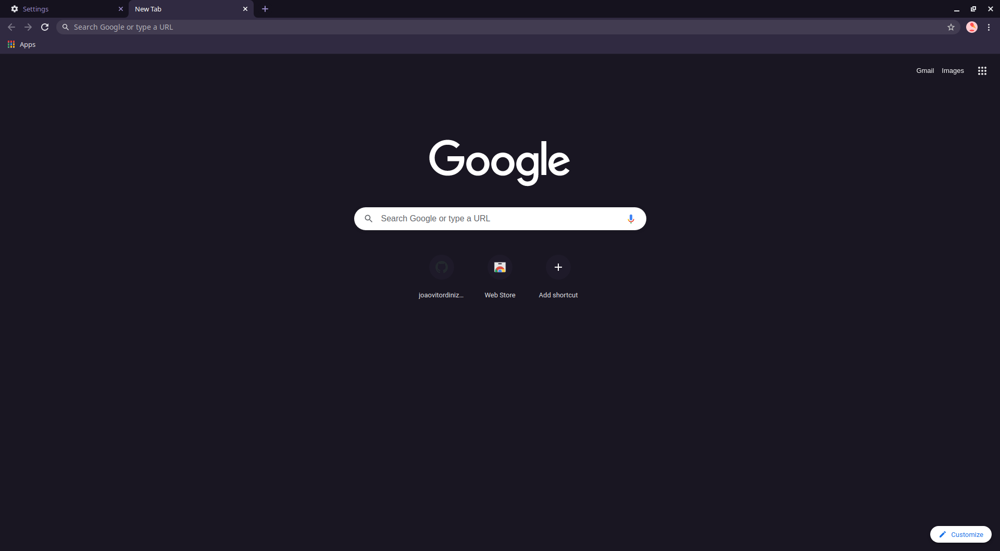

<h1 align="center">
   
 Dark-Purple Theme For <a href="https://www.google.com/chrome">Google Chrome</a>
   
</h1>
 

  

  

  

  <a href="#license">License</a>

## Install

1. Go to `chrome://extensions`
2. Enable `Developer mode` <small>(top-right corner)</small>
3. Click on `Load unpacked` button <small>(top-left corner)</small>
4. Select the `Dark-Purple-main` folder and done
